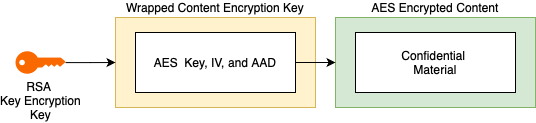

# Confidential Azure KeyVault Objects Terraform Provider

## The problem this provider solves
This provider solves the problem of securely packaging confidential material (such OAuth key secrets, API keys,
encryption/signing keys, etc.) together with the application deployments without compromising confidentiality of the
overall deployment.

Standard Azure KeyVault Terraform resources [azurerm_key_vault_key](https://registry.terraform.io/providers/hashicorp/azurerm/latest/docs/resources/key_vault_key),
do not provide means of importing keys into key vault. This is understandable as an unencrypted version of the private
key would need to available in the source code! [Importing X509 certificates](https://registry.terraform.io/providers/hashicorp/azurerm/latest/docs/resources/key_vault_certificate)
does offer protection if importing from a password-protected PFX file; however, the password needs to be 
in the configuration. [Secret](https://registry.terraform.io/providers/hashicorp/azurerm/latest/docs/resources/key_vault_secret)
do need to be specified in the Terraform source code by value.

Yet there are scenarios—e.g., in the context of building DevOps platform operations—where a feature team
may need package-specific cryptographic material alongside the application code. To give example: a feature team is collaborating
with a third-party vendor which requires signing API requests with the specific, **vendor-issued** RSA key. 

It is possible to arrange a transmissions of key materials from a feature team into platform's security storage. 
However, this practice can quickly turn into a taxing, error-prone operation as the number of feature teams requiring
the use of specific secrets and keys increases. 

This provider allows the DevOps platform operations to empower the feature team to securely package specific key 
material as Terraform source code *by value* without compromising the integrity of the confidential material. Ultimately, allowing 
achieving DevOps self-service experience to the feature teams to rotate confidential material in a centralized
platform themselves.

## How it works

The provider works by implementing a combination of AES and RSA encryption techniques to encrypt the sensitive
secret, key, and certificate data so that it can be safely stored in the Terraform source code. The following
picture explains a high-level design:



As a first step, the confidential material would be encrypted using a randomly-generated AES key. This allows
encrypting a very large sensitive material (such as TLS certificates). The AES key is then wrapped (that is, 
encrypted) with an RSA public key. This key is termed Key Wrapping Key (because it wraps the AES key), 
or KEK for short.

With this setup, a KEK's public key can be widely distributed so that people intending to protect their secrets
can encrypt these for storing in the Terraform source code. 

Deciphering
the encrypted text requires having access to the private key of the KEK.
> The security of the encryption thus is only as good as the access protection to the KEK's private key.

A safe operation of this provider relies on two main factors:
- that a KEK will be created in Azure Key Vault (so that the private key cannot be exposed); and
- that the access to KEK will be limited only the process running the provider. For example; a Terraform Enterprise
  server.

## Setting up
[This guide](./docs-templates/guides/setup.md) explains the minimal setup process that would be required for
starting evaluation and testing process.
> Note that further hardening on top op the propose initial setup may be required for the production setup. 

## How to create Terraform code

The encryption process required for making this to work is complex. The Terraform code (and ciphertext) is
created with the supplied CLI tool `tfgen`. Consult the [tool instructions](./docs-templates/guides/tfgen.md)
how to use it.

## Ephemeral Key Material
The provider requires ephemeral (that is, throwaway) key material for testing cryptographic operations.
These need to be created after code is checked out from the repository using the following command:
```shell
make ephemeral_keys
```

## Testing the provider

The provider can be tested with Golang unit test and Terraform acceptance test. Unit tests can be run
using the following command:
```shell
make test
```
Running acceptance tests on your workstation required two pre-conditions:
1. The environment needs to be configured to use dev overrides for Terraform providers. To achieve this,
   the file `~/.terraformrc` needs to be created containing:
 ```hcl
provider_installation {

  # Configure this provider to be loaded from the Go bin directory (~/go/bin)
  dev_overrides {
    "hashicorp.com/lspwd2/az-confidential" = "...path to your golang bin directory...."
  }
  
  # For all other providers, install them directly from their origin provider
  # registries as normal. If you omit this, Terraform will _only_ use
  # the dev_overrides block, and so no other providers will be available.
  direct {}
}

```

2. You need to create environment variables that point to the *reaal* Azure key vault containing
   the KEK and a key vault where the secrets, keys, and certificates would be imported
```shell
export TF_VAR_az_tenant_id="...your az key vault tenant id ...."
export TF_VAR_az_subscription_id="...your subscription ...."
export TF_VAR_az_client_id="... application granted access to use ..."
export TF_VAR_az_client_secret="... application secret ..."

export TF_VAR_az_default_vault_name="... name of the key vault containing KEK ..."
export TF_VAR_az_default_wrapping_key="... KEK name ...."
export TF_VAR_az_default_wrapping_key_version="... KEK version..."    
```
