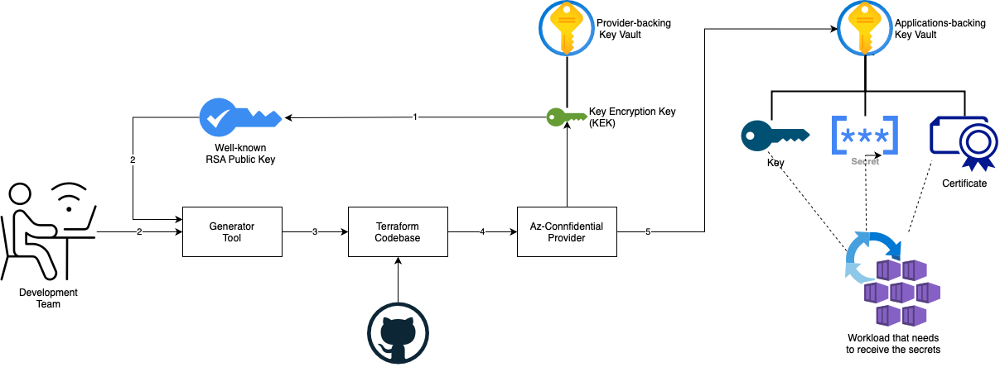

# Setting up the infrastructure to back the provider operation

This provider is designed on the assumption that there will be two Azure Key Vaults allocated:
- First Key Vault termed *provider-backing key vault* will host the Key Encryption Key (or KEK for short).
  This key will be used to decrypt the confidential material. The access to this key needs to be locked
  down to the process that will be executing this provider. The methods to achieve this vary depending
  on the specifics of your configuration.
- Second Key Vault termed *application-backing key vault* is the key vault where the confidential
  secrets, keys, and certificates need to be unpacked into.

The figure below illustrates this.


## Steps

### Step 1: Allocate Provider-Backing Key Vault

The key vault backing the provider hosts the Key Encryption Key. It is RSA key used to encrypt confidential
material a development team wishes to store. The following *minimal* Terraform code creates
the simplest (but not necessarily the *safest*) setup:

```terraform
resource "azurerm_resource_group" "kv_group" {
  location = "West Europe"
  name     = var.rg_name
}


resource "azurerm_key_vault" "kv" {
  location            = azurerm_resource_group.kv_group.location
  name                = var.provider_backing_vault_name
  resource_group_name = azurerm_resource_group.kv_group.name
  sku_name            = "standard"
  tenant_id           = local.tenant_id

  enable_rbac_authorization     = true
  enabled_for_disk_encryption   = true
  public_network_access_enabled = true
  soft_delete_retention_days    = 7

  purge_protection_enabled = false
}

resource "azurerm_key_vault_key" "kek" {
  depends_on = [
    azurerm_role_assignment.kv_deployer
  ]

  key_opts = [
    "decrypt",
    "encrypt",
    "sign",
    "unwrapKey",
    "verify",
    "wrapKey",
  ]

  key_type     = "RSA"
  key_size     = 4096
  key_vault_id = azurerm_key_vault.kv.id
  name         = var.kek_name
}

output "kek_public_pem" {
  value = azurerm_key_vault_key.kek.public_key_pem
}

```

> Note: this is *not* a complete Terraform project that would be required to deploy these resources. This guide assumes
> that the user of this provider is already familiar with AzureRM Terraform provider. This, an extended explanation
> is omitted here for brevity.

The output variable `kwk_public_pem` will contain the public key that can be distributed to the product team(s) 
wishing to encrypt their secrets for the safe storage in the Terraform source code.

Along with the Key Vault setup, the credentials to access the KEK key need to be created and assigned to the 
service principal that the provider will be using. The exact method to do this depends on many considerations that our
outside of scope of this guide. The following *minimal* Terraform code generates the client application and creates 
client credentials that a Terraform provider will need to use:

```terraform

resource "azuread_application" "tf_provider" {
  display_name = "AzConfidential TF Provider"
}

resource "azuread_application_password" "tf_provider" {
  application_id = azuread_application.tf_provider.id
}

resource "azuread_service_principal" "tf_provider" {
  client_id = azuread_application.tf_provider.client_id
}

# -----------------
# Grant vault Crypto Operator
# -----------------
locals {
  rbac_roles = tomap({
    "crypto_oofficer" : "Key Vault Crypto Officer",
    "secrets_officer" : "Key Vault Secrets Officer",
    "certificates_officer" : "Key Vault Certificates Officer"
  })
}

resource "azurerm_role_assignment" "app_access_role" {
  for_each = local.rbac_roles

  principal_id         = azuread_service_principal.tf_provider.object_id
  scope                = azurerm_key_vault.kv.id
  role_definition_name = each.value
}

output "tf_provider_client_id" {
  value = azuread_application.tf_provider.client_id
  sensitive = true
}

output "tf_provider_client_secret" {
  value = azuread_application_password.tf_provider.value
  sensitive = true
}
```
> Note: depending on the credentials used to create this application, the deployer may need to grant administrative
> consent to the created application as well.

### Step 2: Publish the Public Key

The public key of KEK can be widely published within your organization on appropriate sources.

The holder of a secret (such as e.g. product team) will use the provided `tfgen` tool to generate the Terraform
code. [This guide](tfgen.md) explains the command-line syntax of this tool.

### Step 3: Add code to the shared repository

After the secrets have been encrypted, these can be safely shared, e.g., in a GitHub repository.

### Step 4: Execute Terraform Plan/Apply cycle

During the plan/apply cycle, the Az-Confidential provider will decrypt the confidential material using the access
permissions to the KEK.
> The provider does neither log nor store the actual *value* of the confidential material in the Terraform state. 

### Step 5: Entering secrets, keys, and certificates into the application-backing vault

Upon successful decryption, the secret, keys, and certificates are entered into the application-backing vault. From
that moment onwards, these could be pulled into the workloads in accordance with the workload design.

## Hardening Considerations

These are the conditions that you could consider when implementing a production-grade setup:
1. Use default provider authentication (i.e. login via az cli, PowerShell, or managed identity)
2. The KEK should be protected against accidental (or malicious) overwriting
3. Rotate KEK periodically to ensure that confidential data is re-encrypted by the respective owners
4. Turn on string label matching and version tracking inside provider
5. Consider creating dedicated roles for the provider to limit the possible use of imported secrets.